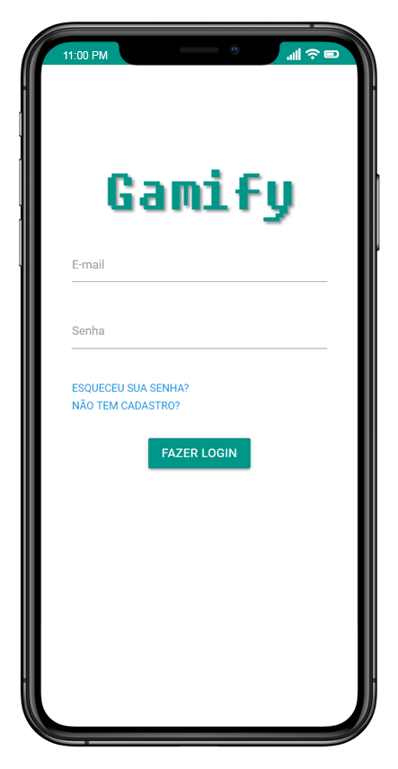
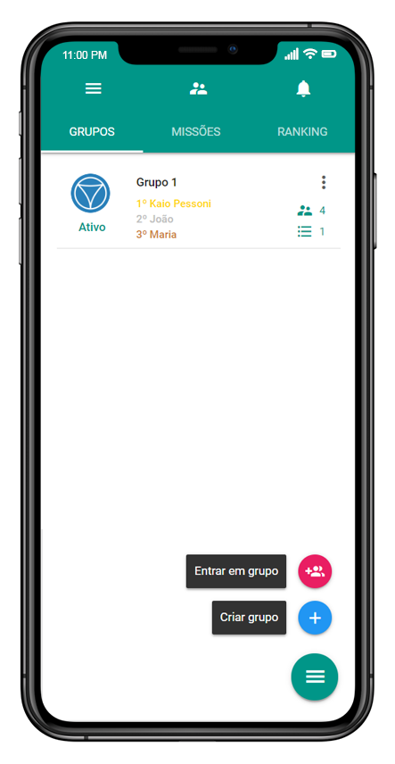
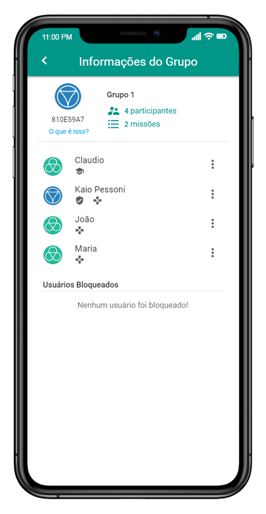
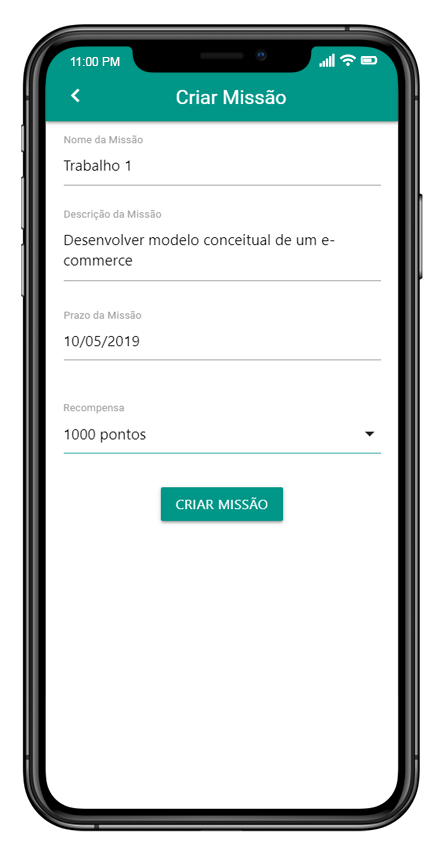
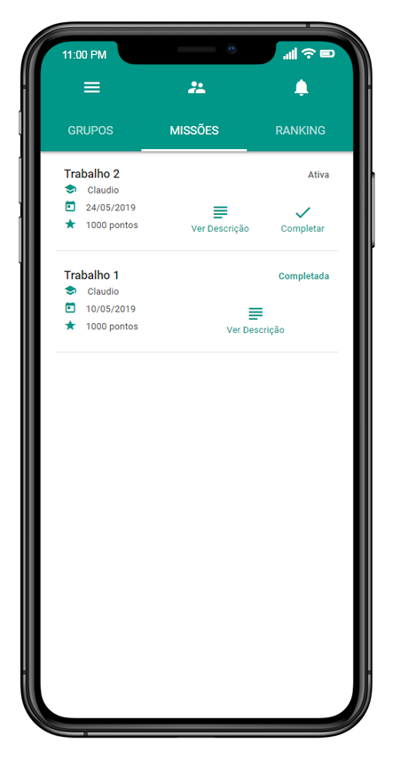
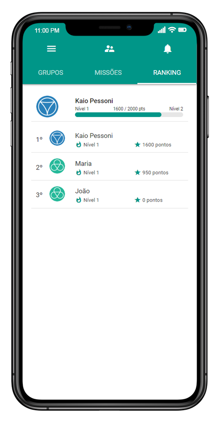

# Gamify

### What is it?
This project was my college paper, here it is the abstract:  
_As a proposal to boost the interest and productivity of students in the accomplishment of tasks, the mobile application Gamify was developed. Following the concept of gamification, the project resulted in an application where the teacher can create a group with students and missions to be completed. Upon completing a mission, students receive rewards, causing them to move up in a ranking of students. By using this ranking, it is expected that the motivation and incentive to finish the tasks will naturally arise in the students, driven by competitiveness, thus this will increase their productivity._

### The App

  

  

### Technologies Used

- PHP7
- MySQL
- jQuery
- Materialize
- Sass
